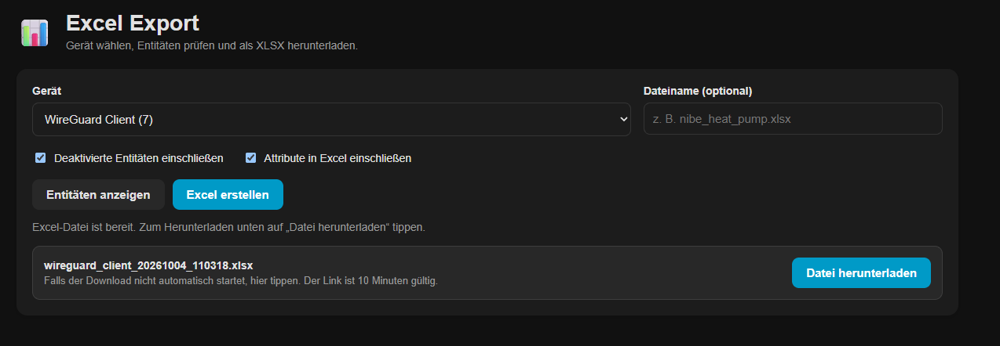

# Device Entity XLSX Export

[](https://github.com/Soul7495/Excel_Export_HA/releases/latest)
[](https://github.com/Soul7495/Excel_Export_HA/actions/workflows/hacs.yml)
[](https://github.com/Soul7495/Excel_Export_HA/actions/workflows/hassfest.yml)
[](LICENSE)

Export every entity assigned to a Home Assistant device as a structured Excel workbook. The integration adds an administrator-only **Excel Export** panel to the Home Assistant sidebar and works in desktop browsers as well as the Home Assistant Companion App.



## Features

- Select one or multiple devices and see how many entities belong to each one.
- Preview entity IDs, names, states, units, integrations and availability.
- Include disabled Entity Registry entries.
- Optionally include state attributes as JSON.
- Export device data, entities and export metadata to separate worksheets.
- Choose a custom filename or let the integration generate one.
- Download through a short-lived HTTP(S) link that works with desktop browsers and Companion App WebViews.
- Use the `device_entity_xlsx_export.export_device` action in automations to save workbooks under `/config/entity_exports/`.
- Keep all Home Assistant data local; no information is sent to external services.

## Requirements

- Home Assistant 2026.8 or newer
- HACS
- A Home Assistant administrator account for the sidebar panel

## Installation

### HACS custom repository

Until the integration is included in the default HACS catalog:

1. Open **HACS** in Home Assistant.
2. Open the menu in the top-right corner and select **Custom repositories**.
3. Add `https://github.com/Soul7495/Excel_Export_HA` and choose **Integration** as the category.
4. Search for **Device Entity XLSX Export** and install it.
5. Restart Home Assistant.
6. Go to **Settings → Devices & services → Add integration**.
7. Search for **Device Entity XLSX Export** and add it once.

The **Excel Export** entry will then appear in the Home Assistant sidebar.

## Usage

1. Open **Excel Export** from the sidebar.
2. Select one or multiple devices.
3. Optionally enter a filename and adjust the export options.
4. Select **Show entities** to preview the data.
5. Select **Create Excel file**.
6. Select **Download file** when the workbook is ready.

The prepared download link is valid for 10 minutes. The workbook is held temporarily in Home Assistant memory and is removed automatically. Explicitly selecting **Download file** prevents embedded browser views from navigating away from the panel.

## Workbook contents

The generated `.xlsx` file contains:

- a device overview;
- all assigned Entity Registry entries;
- current state, unit, platform, device class and state class;
- unique IDs and registry metadata;
- optional state attributes represented as JSON;
- export time and export settings.

Text that begins with `=`, `+`, `-` or `@` is escaped to prevent spreadsheet formula injection.

## Automation action

The integration also provides an action that saves the workbook directly to `/config/entity_exports/`:

```yaml
action: device_entity_xlsx_export.export_device
data:
  device_id: YOUR_DEVICE_ID
  filename: heat_pump.xlsx
  include_disabled: true
  include_attributes: true
```

## Updating

Install updates through HACS and restart Home Assistant afterwards. If the sidebar still shows an older interface, fully close the Companion App or perform a hard refresh in the browser with `Ctrl` + `F5`.

## Security and privacy

- Device, entity and export-preparation endpoints require an authenticated Home Assistant administrator.
- Downloads use cryptographically random, short-lived tokens.
- Prepared workbooks remain in memory only; at most 20 downloads are retained temporarily.
- Responses disable caching and include attachment headers for normal browser downloads.
- Filenames are sanitized and cannot contain path components.
- No telemetry or external data transfer is used.

## Troubleshooting

### The sidebar panel does not appear

Confirm that the integration was added under **Settings → Devices & services**, then restart Home Assistant.

### The old panel is still displayed after an update

Restart Home Assistant and hard-refresh the browser with `Ctrl` + `F5`. On mobile, completely close and reopen the Companion App.

### The download link expired

Select **Create Excel file** again. Each link is intentionally valid for only 10 minutes.

### Reporting a problem

Open a [GitHub issue](https://github.com/Soul7495/Excel_Export_HA/issues) and include:

- the integration version;
- the Home Assistant version;
- browser or Companion App details;
- the relevant Home Assistant log message, with private information removed.

## Development and validation

Every change is checked with the official HACS validation action and Home Assistant hassfest. Before publishing a release, both workflows should complete successfully.

## License

Device Entity XLSX Export is available under the [MIT License](LICENSE).
